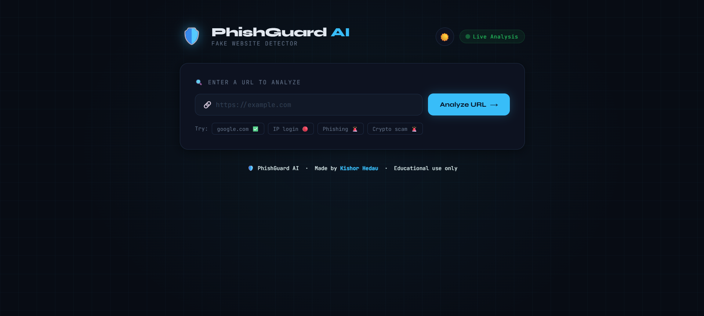

# 🛡️ PhishGuard AI – Fake Website Detector

Detect phishing and malicious URLs using heuristic analysis.
Built with **Python Flask** (backend) + **Vanilla JS** (frontend).

---

## 🔍 Preview



---

## 📁 Project Structure

```
phishguard/
├── app.py                  ← Flask backend (REST API)
├── requirements.txt        ← Python dependencies
├── templates/
│   └── index.html          ← Main UI page
└── static/
    ├── style.css           ← Dark-theme stylesheet
    └── script.js           ← Frontend logic
```

---

## 🚀 Setup & Run

### 1. Install Python dependencies
```bash
pip install -r requirements.txt
```

### 2. Start the Flask server
```bash
python app.py
```

### 3. Open your browser
```
http://127.0.0.1:5000
```

---

## 🔍 How It Works

| Check | Risk Added |
|---|---|
| URL does not use HTTPS | +30 |
| URL contains suspicious keywords (login, verify, bank…) | +20 |
| URL is longer than 50 characters | +10 |
| URL uses an IP address instead of a domain | +25 |
| URL has excessive subdomains (>4 parts) | +10 |
| URL contains @ symbol | +15 |

**Classification:**
- **0–29** → ✅ Safe
- **30–59** → ⚠️ Suspicious  
- **60–100** → 🚨 Dangerous

---

## 🛠️ API Endpoint

`POST /analyze`

**Request:**
```json
{ "url": "https://example.com" }
```

**Response:**
```json
{
  "score": 45,
  "classification": "Suspicious",
  "url": "http://login.verify-bank.com/account",
  "reasons": [
    { "icon": "🔓", "text": "No HTTPS – connection is not encrypted", "severity": "high" },
    { "icon": "⚠️", "text": "Suspicious keywords detected: login, verify, bank, account", "severity": "medium" }
  ]
}
```

---

## ⚠️ Disclaimer
This tool uses heuristic checks and is intended for **educational purposes only**.
It does not replace professional cybersecurity tools.
